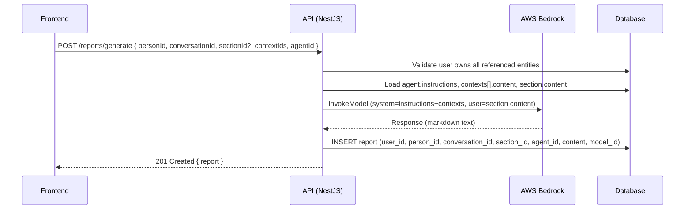
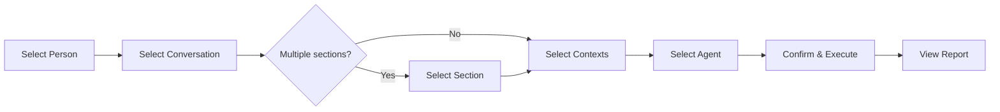
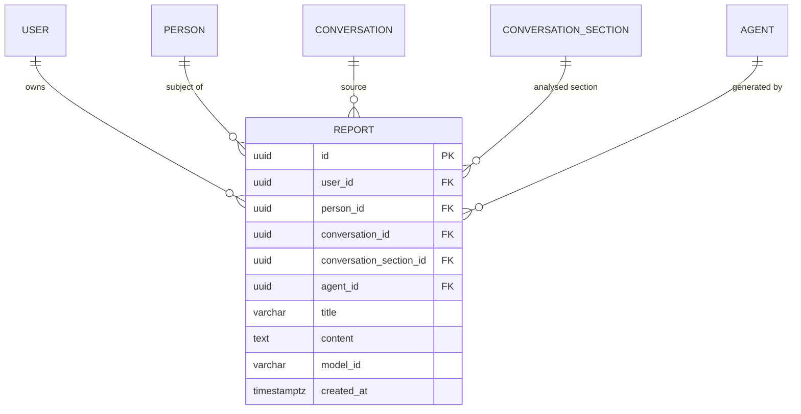

# 0004 — Conversation Analysis Workflow

**Date:** 2026-05-22
**Status:** Accepted
**Author:** Architect
**Feature:** docs/features/0004-conversation-analysis-workflow.md

---

## Problem / Motivation

Converser can ingest conversations, manage agents (with configurable instructions), and manage contexts (user-authored background content). However, there is no execution pipeline — no way to invoke an agent against a conversation to produce analysis output. This is the core value proposition of the tool. Without it, conversations sit idle and agents are never executed. The home page is currently a static welcome page with no primary action — replacing it with the guided workflow gives users immediate access to the most important action in the system.

---

## Proposed Solution

Introduce a **Reports module** (backend) and replace the **home page** (frontend) with a step-by-step workflow that culminates in a Bedrock invocation. The workflow guides the user through: Person → Conversation → Section (if multiple) → Context(s) → Agent → Execute → View Report.

### Database Schema

**`reports` table**

| Column | Type | Notes |
|---|---|---|
| `id` | uuid (PK) | Generated |
| `user_id` | uuid (FK → users.id) | Owner; CASCADE on delete |
| `person_id` | uuid (FK → people.id) | Link to person; SET NULL on delete |
| `conversation_id` | uuid (FK → conversations.id), nullable | Reference; SET NULL on delete |
| `conversation_section_id` | uuid (FK → conversation_sections.id), nullable | Which section was analysed; SET NULL on delete |
| `agent_id` | uuid (FK → agents.id), nullable | Which agent was used; SET NULL on delete |
| `title` | varchar(255) | Auto-generated: "{Agent name} — {Conversation title}" |
| `content` | text | Markdown output from Bedrock |
| `model_id` | varchar(255) | Bedrock model ID used |
| `created_at` | timestamptz | |

### API Endpoints

**Reports**

| Method | Path | Description |
|---|---|---|
| POST | `/reports/generate` | Execute agent against conversation; store + return report |
| GET | `/reports` | List user's reports (with person, conversation relations) |
| GET | `/reports/:id` | Get single report |
| DELETE | `/reports/:id` | Delete report |
| GET | `/people/:id/reports` | List reports for a specific person |

**Generate DTO:**

```typescript
{
  personId: string;           // Required — the person this report is about
  conversationId: string;     // Required — which conversation to analyse
  sectionId?: string;         // Optional — specific section; if omitted and multiple exist, 400 error
  contextIds: string[];       // Required — array of context IDs to include (can be empty)
  agentId: string;            // Required — which agent's instructions to use
}
```

### Bedrock Integration

A new `BedrockService` (injectable, within the reports module) encapsulates the AWS SDK call:

```typescript
@Injectable()
export class BedrockService {
  constructor(private readonly configService: ConfigService) {}

  async invoke(params: {
    systemPrompt: string;    // Agent instructions + context content
    userMessage: string;     // Conversation section content
  }): Promise<string> {
    // Uses @aws-sdk/client-bedrock-runtime
    // Model ID from ConfigService (AWS_BEDROCK_MODEL_ID)
    // Region from ConfigService (AWS_REGION)
    // Returns the text content from the response
  }
}
```

**Prompt assembly** (in `ReportsService`):
- **System prompt** = Agent instructions + "\n\n---\n\n" + concatenated context content (each prefixed with "## {context name}\n\n{content}")
- **User message** = Conversation section content

This keeps the agent instructions as the "persona/role" and context as additional reference, with the conversation as the user-provided input to analyse.

### Execution Flow



### Frontend Workflow (Home Page Replacement)

The home page becomes a multi-step form implemented as a single client component with internal step state (Zustand store or local `useState`).

**Steps:**

1. **Select Person** — List of user's people (fetched from `GET /people`). Each displayed as a card/row.
2. **Select Conversation** — Filtered to conversations linked to the selected person (`GET /conversations?personId={id}`). Also show unlinked conversations.
3. **Select Section** — If the conversation has >1 section, show a list of section titles. If only 1 section, auto-select and skip this step.
4. **Select Context(s)** — Multi-select from user's contexts (`GET /contexts`). Optional — user can proceed with zero contexts.
5. **Select Agent** — List of user's agents (`GET /agents`). Each shows name + description.
6. **Confirm & Execute** — Summary of all selections. "Generate Report" button. Loading state during Bedrock call.
7. **View Report** — Display the markdown output using a read-only markdown renderer. Link to view it under the person's reports list.

**Navigation:** Back/forward between steps. Progress indicator showing current position.



### Backend Module Structure

```
backend/src/reports/
├── reports.module.ts
├── reports.controller.ts
├── reports.service.ts
├── bedrock.service.ts
├── dto/
│   ├── generate-report.dto.ts
│   └── report-response.dto.ts
└── entities/
    └── report.entity.ts      (or in database/entities/)
```

The entity file goes in `backend/src/database/entities/report.entity.ts` to match the existing pattern.

### ER Diagram



---

## Acceptance Criteria

1. `POST /reports/generate` validates that the authenticated user owns all referenced entities (person, conversation, section, contexts, agent) — returns 403 if not.
2. `POST /reports/generate` assembles the prompt (system = agent instructions + contexts; user = section content) and invokes Bedrock via `@aws-sdk/client-bedrock-runtime`.
3. `POST /reports/generate` stores the response as a Report entity with markdown content and returns it with 201.
4. `GET /reports` returns all reports for the authenticated user, ordered by `created_at` descending.
5. `GET /people/:id/reports` returns reports linked to a specific person.
6. `DELETE /reports/:id` removes a report owned by the authenticated user.
7. The home page displays a multi-step workflow: Person → Conversation → Section (conditional) → Contexts → Agent → Execute.
8. When a conversation has a single section, the section selection step is skipped automatically.
9. When a conversation has multiple sections, the user must select one before proceeding.
10. The workflow shows a loading state during Bedrock invocation and displays the markdown result upon completion.
11. Bedrock model ID and AWS region are read from `ConfigService` (environment variables).
12. No PII or conversation content appears in log output — only report ID, user ID, model ID, and token counts are logged.
13. The report is visible under the person's reports list after generation.

---

## Key Design Decisions

1. **Reports module owns Bedrock integration** — `BedrockService` lives inside the reports module since agent execution only makes sense in the context of producing a report. If other modules need Bedrock later, it can be extracted to a shared module.
2. **System prompt = instructions + contexts; User message = conversation** — This maps cleanly to Claude's system/user message paradigm: the agent defines the role, contexts provide reference material, and the conversation is the input to analyse.
3. **Single section per report** — Each report analyses one section (tab) at a time. This avoids exceeding Bedrock's context window and makes reports granular and attributable.
4. **Report stores model_id** — For auditability and reproducibility: know exactly which model produced each output.
5. **Frontend workflow as local state, not URL-based routing** — The workflow is a single interaction, not a multi-page flow. Using local component state (or a Zustand store) keeps it simple. The URL stays at `/`.
6. **No streaming for v1** — The initial implementation uses synchronous `InvokeModel`. Streaming can be added as an enhancement once the core loop is working.
7. **Soft references (SET NULL)** — If a person, conversation, or agent is deleted, the report remains readable (with null foreign keys) rather than being cascade-deleted. Reports are historical records.

---

## Alternatives Considered

| Alternative | Why rejected |
|---|---|
| Streaming Bedrock responses (InvokeModelWithResponseStream) | Adds complexity (SSE/WebSocket) for v1; synchronous is simpler and adequate for initial use |
| Separate "execution" entity + report entity | Over-engineering for now; one entity captures both the invocation metadata and output |
| Store report as JSON (structured output) | The brief specifies markdown format; structured parsing is a future feature |
| URL-based multi-page wizard (separate routes per step) | The steps are lightweight selects, not full pages; single-component state is simpler |
| Queue-based async execution | Bedrock calls typically complete in 5-30 seconds; synchronous with loading state is acceptable for v1 |
| Contexts as part of user message rather than system prompt | System prompt is the correct place for reference/background material per Claude's design |

---

## Dependencies

### New npm packages (backend)
- `@aws-sdk/client-bedrock-runtime` — AWS SDK v3 client for Bedrock model invocation

### New npm packages (frontend)
- None — uses existing `react-markdown` or similar if already present; otherwise renders with CodeMirror in readonly mode (already available)

---

## Impact Assessment

| Area | Impact | Notes |
|---|---|---|
| Database | Migration required / New entity | `reports` table with FK relationships |
| API contract | Additive | New `/reports` endpoints; existing endpoints unchanged |
| Frontend | Component change / New page content | Home page replaced with workflow component |
| Tests | New unit tests + integration tests | BedrockService (mocked), ReportsService, workflow component |
| External API | New endpoint: AWS Bedrock | `InvokeModel` — subject to token limits and throttling |
| Infrastructure | None for now | Uses AWS SDK default credential chain; no new IAM resources in IaC for local dev |
| Observability | New log fields | Report generation events: report_id, user_id, model_id, duration_ms, token_count |
| Security / Compliance | New data handling | Report content is `internal` (derived analysis, not raw conversation); conversation content passes through memory during invocation but is not logged |

---

## Infrastructure Addendum

No new cloud infrastructure resources for the development phase. The backend uses the AWS SDK default credential chain (`AWS_ACCESS_KEY_ID`/`AWS_SECRET_ACCESS_KEY` in `.env` for local dev, task IAM role in production).

**Production note (deferred to infra feature):** When deploying, the ECS task role will need `bedrock:InvokeModel` permission scoped to the configured model ARN. This is a future infra change — not part of this feature's scope.

---

## Security Considerations

- **Conversation content in transit to Bedrock** — Sent over TLS to AWS Bedrock endpoint. Content is classified `confidential`; AWS Bedrock does not retain input/output data for model training (per AWS Bedrock data privacy terms).
- **Report content classification** — Reports contain AI-generated analysis, not raw conversation data. Classified as `internal`. Stored in PostgreSQL (RDS with AES-256 encryption at rest).
- **No PII in logs** — Log the report ID, user ID, model ID, and duration. Never log prompt content, conversation content, or report output.
- **User isolation** — All queries filter by `user_id` from JWT. The generate endpoint validates ownership of every referenced entity before proceeding.
- **AWS credentials** — Read from environment via `ConfigService`. Never exposed to frontend. In production, IAM task role eliminates static credentials entirely.

---

## Open Questions

None — all questions from the feature document have been resolved by design decisions above (multiple contexts: yes; model configurable: yes via env var; loading indicator: yes).
