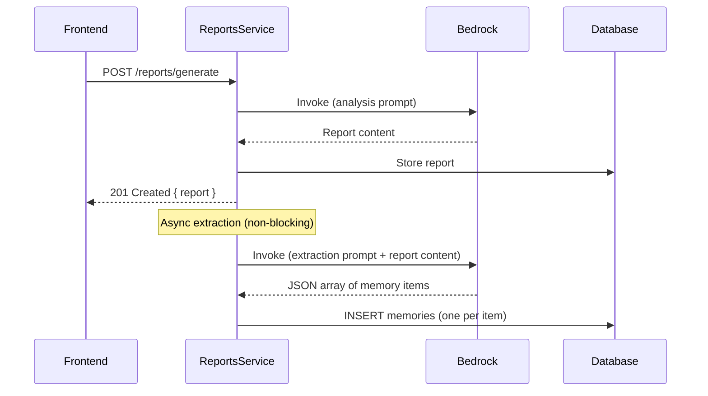
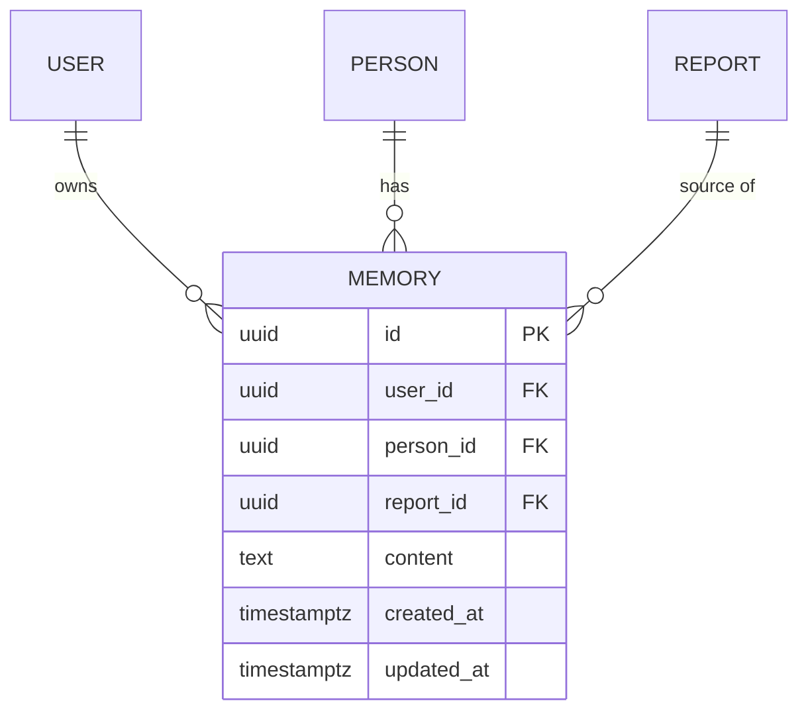

# 0005 — Person Memory

**Date:** 2026-05-22
**Status:** Accepted
**Author:** Architect
**Feature:** docs/features/0005-person-memory.md

---

## Problem Statement

Each report is generated in isolation — the agent has no knowledge of prior interactions with a person. Recurring themes, agreed action items, and established facts are lost between sessions unless the user manually recreates them as contexts. This limits the system's ability to provide continuity and depth in analysis over time.

---

## Proposed Solution

Introduce a **Memory** entity linked to a Person, a **MemoryService** for CRUD and extraction, and modify the report generation flow to:

1. **After generation:** make a second Bedrock call with a dedicated extraction prompt to pull key items from the report, then persist them as memory entries.
2. **During generation:** include the person's accumulated memory in the system prompt alongside agent instructions and contexts.

### Database Schema

**`memories` table**

| Column | Type | Notes |
|---|---|---|
| `id` | uuid (PK) | Generated |
| `user_id` | uuid (FK → users.id) | Owner; CASCADE on delete |
| `person_id` | uuid (FK → people.id) | Subject; CASCADE on delete |
| `report_id` | uuid (FK → reports.id), nullable | Source report; SET NULL on delete |
| `content` | text | The memory item (short factual statement) |
| `created_at` | timestamptz | |
| `updated_at` | timestamptz | |

### API Endpoints

**Memory**

| Method | Path | Description |
|---|---|---|
| GET | `/people/:personId/memories` | List all memory items for a person |
| PATCH | `/people/:personId/memories/:id` | Update a memory item's content |
| DELETE | `/people/:personId/memories/:id` | Delete a memory item |

Memory creation is automatic (via report generation) — no manual POST endpoint for v1.

### Extraction Flow

After a report is generated and stored, a second Bedrock call extracts memory items:



The extraction call happens **after** the report is returned to the user, so it does not block the UX. It runs in the same request lifecycle (using `setImmediate` or a fire-and-forget promise) — no queue infrastructure needed for v1.

### Extraction Prompt

A dedicated system prompt instructs Bedrock to extract key items:

```
You are a memory extraction assistant. Given a report about a person, extract the key facts, decisions, action items, and themes as a JSON array of short, factual statements.

Rules:
- Each item should be a single sentence or short phrase
- Focus on facts, decisions made, action items, and recurring themes
- Do not include opinions or speculation
- Return ONLY a valid JSON array of strings, nothing else

Example output: ["Prefers async communication", "Action: migrate to new API by Q2", "Recurring theme: deployment friction"]
```

The user message is the report content. The response is parsed as `string[]` and each item becomes a Memory row.

### Memory Inclusion in Future Prompts

The `assembleSystemPrompt` method in `ReportsService` is extended to include memory:

```
{agent instructions}

---

## Contexts

{context sections}

---

## Memory (prior knowledge about {person name})

- {memory item 1}
- {memory item 2}
- ...
```

### Module Structure

Memory lives within the existing **People** module (since it is tightly coupled to the Person entity lifecycle — cascading deletes, scoped by person):

```
backend/src/people/
├── people.module.ts        (add Memory entity + MemoryService)
├── people.controller.ts    (add memory sub-routes)
├── people.service.ts       (unchanged)
├── memory.service.ts       (new — CRUD + extraction)
├── dto/
│   └── update-memory.dto.ts (new)
└── ...
```

The `ReportsService` will import `MemoryService` to trigger extraction after report generation and to fetch memory during prompt assembly.

### ER Diagram



### Frontend Changes

Add a "Memory" tab/section on the **Person detail page** (`/people/[id]`):

- Lists all memory items for the person (text + source report link + date)
- Inline edit (click to edit, save on blur/enter)
- Delete button per item
- Empty state: "No memories yet. Generate a report to start building memory."

---

## Alternatives Considered

### Alternative A — Structured output from the main agent
Have the main analysis agent return both the report and memory items in a single structured response.

**Why rejected:** Couples the extraction format to the agent instructions, making agents less flexible. Forces all agents to output a specific JSON structure rather than free-form markdown. Also, if the agent fails to produce valid JSON, both the report and memory extraction fail together.

### Alternative B — Background job queue (SQS/Bull)
Use a queue to process memory extraction asynchronously.

**Why rejected:** Over-engineering for v1. The extraction call takes 2-5 seconds — running it fire-and-forget in the same process is adequate. A queue adds infrastructure complexity (SQS or Redis + Bull) for no user-facing benefit at current scale.

### Alternative C — Store memory as a single text blob per person
Instead of individual items, append to a growing text document.

**Why rejected:** Makes editing/deleting individual items impossible. Individual rows give the user fine-grained control and make future features (tagging, categorisation, deduplication) feasible.

---

## Impact Assessment

| Area | Impact | Notes |
|---|---|---|
| Database | Migration required / New entity | `memories` table |
| API contract | Additive | New `/people/:personId/memories` endpoints |
| Frontend | Component change | Memory section on person detail page |
| Tests | New unit tests | MemoryService extraction + CRUD, prompt assembly change |
| External API | Additional Bedrock call per report | One extra invocation per report generation |
| Infrastructure | None | No new cloud resources |
| Observability | New log fields | Memory extraction events: count, duration, parse errors |
| Security / Compliance | New data class | Memory classified as `confidential` (derived from conversations) |

---

## Open Questions

None — the open questions from the feature doc are resolved:
- Format: short factual statements (one sentence each)
- Limit: no hard limit for v1; future feature can prune/summarise
- Extraction method: separate Bedrock call with dedicated extraction prompt

---

## Acceptance Criteria

1. A new `memories` table exists with the schema defined above; migration implements both `up()` and `down()`.
2. After `POST /reports/generate` returns, memory extraction fires (non-blocking) and persists extracted items as Memory rows linked to the person and report.
3. If extraction fails (parse error, Bedrock error), the report remains intact — extraction failure is logged but does not affect the user's report.
4. `GET /people/:personId/memories` returns all memory items for an authenticated user's person, ordered by `created_at` ascending.
5. `PATCH /people/:personId/memories/:id` updates the content of a memory item owned by the authenticated user.
6. `DELETE /people/:personId/memories/:id` removes a memory item owned by the authenticated user.
7. When generating a report for a person who has memory items, those items appear in the system prompt under a "Memory" section.
8. Memory items accumulate — generating a new report adds new items without modifying or deleting existing ones.
9. No memory content (PII-bearing) appears in log output.
10. The person detail page displays memory items with edit and delete capabilities.

---

## Security Considerations

- Memory content is classified as `confidential` — derived from conversation analysis, may contain PII references.
- All memory endpoints enforce user-ID isolation (same pattern as existing entities).
- Memory content is not logged — only item count, person_id, and report_id.
- Extraction prompt instructs the model to produce factual statements, reducing (but not eliminating) risk of sensitive content in memory. The same access controls apply as for reports.
