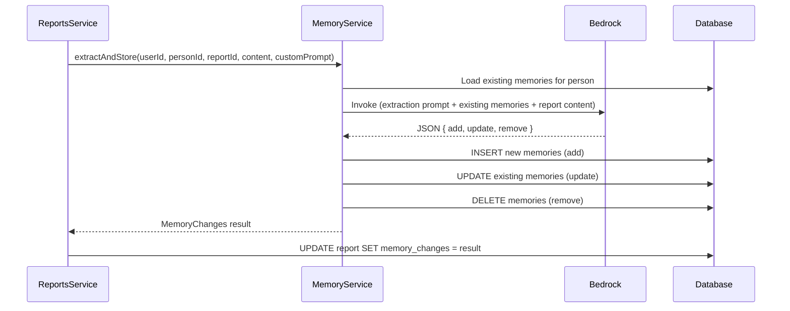

# 0006 — Memory Evolution

**Date:** 2026-05-22
**Status:** Accepted
**Author:** Architect
**Feature:** docs/features/0006-memory-evolution.md

---

## Problem Statement

Memory extraction currently only appends new items — it has no awareness of existing memories. This leads to stale entries (completed actions still listed as pending), contradictions (old preference alongside new), and unbounded growth. Users also have no visibility into what changed after each report was generated. The extraction system needs to evolve memories (update/remove/add) and track those changes per report.

---

## Proposed Solution

### 1. Change the extraction response format

Instead of returning a simple `string[]`, the extraction prompt now instructs the model to return a structured JSON diff:

```json
{
  "add": ["New fact learned"],
  "update": [
    { "id": "memory-uuid-1", "content": "Updated fact (was: old fact)" }
  ],
  "remove": ["memory-uuid-2"]
}
```

### 2. Pass existing memories to the extraction prompt

The extraction system prompt now includes the person's current memories (with IDs) so the model can reference them:

```
Current memories for this person:
- [id:abc123] Prefers async communication
- [id:def456] Action: migrate API by Q2
- [id:ghi789] Recurring theme: deployment friction
```

### 3. Store memory changes on the report

Add a `memory_changes` JSON column to the `reports` table that captures the diff applied:

```json
{
  "added": [{ "id": "new-uuid", "content": "New item" }],
  "updated": [{ "id": "abc123", "previousContent": "Old text", "content": "New text" }],
  "removed": [{ "id": "ghi789", "content": "Removed item text" }]
}
```

### 4. Display changes on the report detail page

A "Memory Changes" section at the bottom of the report view shows what was added, updated, and removed — with visual differentiation (green for added, yellow for updated with before/after, red for removed).

### Database Changes

**Migration: add `memory_changes` column to `reports`**

| Column | Type | Notes |
|---|---|---|
| `memory_changes` | jsonb, nullable | Structured diff of memory changes applied by this report |

### Updated Extraction Prompt Structure

```
{custom instructions OR default instructions}

Current memories for this person (reference by ID to update or remove):
- [id:{uuid}] {content}
- [id:{uuid}] {content}

Return a JSON object with three keys:
- "add": array of new memory strings to create
- "update": array of objects { "id": string, "content": string } for memories to modify
- "remove": array of memory ID strings to delete

IMPORTANT: Return ONLY a valid JSON object with these three keys, nothing else.
```

### Execution Flow



### Interface Changes

```typescript
interface MemoryChange {
  added: Array<{ id: string; content: string }>;
  updated: Array<{ id: string; previousContent: string; content: string }>;
  removed: Array<{ id: string; content: string }>;
}
```

`extractAndStore` returns `MemoryChange | null` instead of `void`, and `ReportsService` stores it on the report after extraction completes.

### Frontend Changes

On the report detail page (`/reports/[id]`), below the report content, add a "Memory Changes" section:

- **Added** items shown with a green left border
- **Updated** items shown with a yellow left border (showing previous → new)
- **Removed** items shown with a red left border and strikethrough

---

## Alternatives Considered

### Alternative A — Separate memory_changes table
Store each change as a row in a dedicated table.

**Why rejected:** Over-normalised for this use case. The changes are a snapshot tied to a specific report — they don't need to be queried independently. JSONB on the report is simpler and keeps the data co-located with its context.

### Alternative B — Keep append-only, add deduplication later
Don't modify existing memories, just add a deduplication pass.

**Why rejected:** Doesn't solve the core problem of stale/contradictory information. A completed action item should be removed or updated, not deduplicated.

### Alternative C — Version history on each memory
Track every change to each memory row with a history table.

**Why rejected:** Over-engineering for v1. The report's `memory_changes` JSON provides sufficient audit trail of what changed and when. Full version history can be added later if needed.

---

## Impact Assessment

| Area | Impact | Notes |
|---|---|---|
| Database | Migration required | Add `memory_changes` jsonb column to reports |
| API contract | Additive | Report response now includes `memoryChanges` field |
| Frontend | Component change | Memory changes section on report detail page |
| Tests | Updated unit tests | MemoryService extraction logic, ReportsService integration |
| External API | Same Bedrock call count | Extraction prompt changes, same number of calls |
| Infrastructure | None | No new resources |
| Observability | Updated log fields | Memory change counts (added/updated/removed) |
| Security / Compliance | None new | Same data classification, same access controls |

---

## Open Questions

None.

---

## Acceptance Criteria

1. The extraction prompt includes the person's existing memories (with IDs) so the model can reference them for updates/removals.
2. The extraction response is parsed as a structured diff (`{ add, update, remove }`) instead of a flat string array.
3. `add` items create new Memory rows.
4. `update` items modify existing Memory rows in place (content is overwritten).
5. `remove` items delete Memory rows from the database.
6. The memory diff is stored as JSONB in `reports.memory_changes` (including previous content for updates and content for removals).
7. `GET /reports/:id` returns `memoryChanges` in the response.
8. The report detail page displays memory changes at the bottom with visual differentiation (added/updated/removed).
9. If extraction fails or returns invalid JSON, no memories are modified and the report is unaffected (same graceful failure as before).
10. The default extraction prompt is updated to instruct the model to return the structured diff format.
11. Custom extraction prompts also receive existing memories and the JSON format suffix.

---

## Security Considerations

- No new attack surface — same auth guards, same user-ID isolation.
- Memory content remains classified as `confidential`.
- `memory_changes` JSON may contain previous content of updated/removed items — same classification applies.
- No memory content in logs — only change counts.
