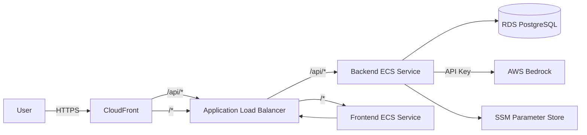

# 0008 — AWS Production Deployment

**Date:** 2026-05-22
**Status:** Accepted
**Author:** Architect
**Feature:** docs/features/0008-aws-production-deployment.md

---

## Problem Statement

Converser runs locally only. It needs a production deployment on AWS accessible at `converser.ops.mypassglobal.com` with managed infrastructure, TLS, and proper secret management. The existing VPC, Route 53 hosted zone, and ECR repository should be reused.

---

## Proposed Solution

Deploy using Terraform with a modular structure. The production environment references shared modules for compute (ECS), data (RDS), and networking (ALB, CloudFront, DNS).

### Architecture



### Network Topology

- **Existing VPC** with IGW — referenced by ID via data source
- **Public subnets** — ALB
- **Private subnets** — ECS tasks, RDS
- **NAT Gateway** — for ECS tasks to reach internet (Bedrock API, Google APIs)

### Resources Created

| Resource | Purpose |
|---|---|
| ACM Certificate | TLS for `converser.ops.mypassglobal.com` (DNS validation) |
| CloudFront Distribution | CDN, TLS termination, caching for static assets |
| ALB + Listeners | Route traffic to ECS services (path-based) |
| ECS Cluster | Container orchestration |
| ECS Service (frontend) | Next.js standalone container |
| ECS Service (backend) | NestJS container |
| ECS Task Definitions | CPU/memory, env vars, IAM roles |
| RDS PostgreSQL 16 | Primary data store (db.t4g.micro, encrypted) |
| RDS Subnet Group | Private subnets for DB |
| Security Groups | ALB (443 inbound), ECS (ALB only), RDS (ECS only) |
| IAM Task Role (backend) | bedrock:InvokeModel, ssm:GetParameter, logs:* |
| IAM Task Execution Role | ECR pull, CloudWatch logs, SSM secrets |
| CloudWatch Log Groups | ECS task logs |
| Route 53 A Record | `converser.ops.mypassglobal.com` → CloudFront |
| NAT Gateway | Outbound internet for private subnets |

### Terraform Structure

```
infra/
├── modules/
│   ├── network/          (ALB, security groups, NAT GW)
│   ├── compute/          (ECS cluster, services, task defs, IAM)
│   ├── data/             (RDS, subnet group)
│   └── dns/              (ACM, Route 53, CloudFront)
└── envs/
    └── prod/
        ├── main.tf       (module calls, provider config)
        ├── variables.tf  (environment-specific vars)
        ├── outputs.tf    (ALB DNS, CloudFront URL, RDS endpoint)
        ├── terraform.tf  (required_providers, backend config)
        └── prod.tfvars   (var values — NOT committed, in .gitignore)
```

### State Backend

S3 bucket + DynamoDB lock table (per CLAUDE.md settled decisions). State key: `converser/prod/terraform.tfstate`.

### Path-Based Routing

| Path | Target |
|---|---|
| `/api/*` | Backend ECS service (port 3001) |
| `/*` | Frontend ECS service (port 3000) |

CloudFront forwards all requests to the ALB origin. The ALB routes based on path prefix.

### Container Configuration

**Backend:**
- Image: existing ECR repo
- Port: 3001
- Health check: `GET /health`
- CPU: 256, Memory: 512
- Env vars from SSM: DB host/pass, JWT secret, Google creds, Bedrock API key, encryption key

**Frontend:**
- Image: existing ECR repo (Next.js standalone output)
- Port: 3000
- Health check: `GET /`
- CPU: 256, Memory: 512
- Env vars: `NEXT_PUBLIC_API_URL=https://converser.ops.mypassglobal.com/api`

### Secret Management

All secrets stored in SSM Parameter Store as SecureString:

| Parameter | Type |
|---|---|
| `/converser/prod/db-password` | SecureString |
| `/converser/prod/jwt-secret` | SecureString |
| `/converser/prod/google-client-id` | SecureString |
| `/converser/prod/google-client-secret` | SecureString |
| `/converser/prod/google-token-encryption-key` | SecureString |
| `/converser/prod/bedrock-api-key` | SecureString |

Secrets are created out-of-band (manually in AWS console or CLI) and referenced by ARN in Terraform.

---

## Alternatives Considered

### Alternative A — App Runner
Simpler deployment but less control over networking, no path-based routing between services, limited VPC integration.

**Why rejected:** Need path-based routing for frontend/backend split, and VPC private subnet access for RDS.

### Alternative B — EC2 instances with Docker Compose
Cheap but no orchestration, no auto-healing, manual scaling, operational burden.

**Why rejected:** Against project conventions (managed services preferred). ECS Fargate eliminates instance management.

### Alternative C — Single container (frontend + backend combined)
Simpler deployment but couples release cycles, wastes resources, harder to scale independently.

**Why rejected:** User explicitly requested separate services.

---

## Impact Assessment

| Area | Impact | Notes |
|---|---|---|
| Database | New RDS instance | PostgreSQL 16, db.t4g.micro, encrypted |
| API contract | None | Same API, new host |
| Frontend | Build change | Next.js standalone output mode for container |
| Tests | None | No test changes |
| External API | None | Same Bedrock/Google APIs |
| Infrastructure | All new | Full production stack |
| Observability | CloudWatch Logs | ECS task logs → CloudWatch |
| Security / Compliance | IAM, TLS, encryption | KMS for RDS, ACM for TLS, least-privilege IAM |

---

## Infrastructure Addendum

### Resources

All resources listed in the "Resources Created" table above.

### Cost Estimate

| Resource | Estimated Monthly Cost |
|---|---|
| ECS Fargate (2 services, 0.25 vCPU, 0.5GB each) | ~$20 |
| RDS db.t4g.micro (single-AZ) | ~$15 |
| ALB | ~$16 + data |
| NAT Gateway | ~$32 + data |
| CloudFront | ~$1-5 (low traffic) |
| Route 53 | ~$0.50 |
| CloudWatch Logs | ~$1-3 |
| **Total** | **~$85-95/mo** |

### Failure Modes & Blast Radius

- **ECS task failure:** Auto-restarted by ECS. Health check deregisters unhealthy tasks.
- **RDS failure:** Single-AZ — outage until AWS recovers instance. Automated backups enable point-in-time recovery. Consider Multi-AZ as future enhancement.
- **NAT GW failure:** ECS tasks lose internet — Bedrock and Google API calls fail. ALB still serves cached content. AWS-managed, rare.
- **CloudFront failure:** Global AWS outage scenario. Origin (ALB) still accessible directly.

Blast radius is isolated to this single environment.

### Identity & Access

| Principal | Permissions |
|---|---|
| ECS Task Role (backend) | `bedrock:InvokeModel` on model ARN, `ssm:GetParameter` on `/converser/prod/*`, `logs:CreateLogStream`, `logs:PutLogEvents` |
| ECS Task Execution Role | `ecr:GetAuthorizationToken`, `ecr:BatchGetImage`, `ecr:GetDownloadUrlForLayer`, `logs:CreateLogStream`, `logs:PutLogEvents`, `ssm:GetParameters` (for secrets) |
| ECS Task Role (frontend) | `logs:CreateLogStream`, `logs:PutLogEvents` only |

No `*` action on `*` resource. All permissions scoped to specific ARNs.

### State & Locking

- State bucket: existing S3 bucket (to be configured in `terraform.tf`)
- Lock table: existing DynamoDB table
- Key: `converser/prod/terraform.tfstate`

### Rollback Plan

- **ECS:** Roll back to previous task definition revision (`aws ecs update-service --force-new-deployment` with previous task def)
- **RDS:** Point-in-time recovery from automated backups (7-day retention)
- **Terraform:** `terraform plan` with previous code, `terraform apply` to revert resources
- **DNS/CloudFront:** Low TTL on initial deployment (60s), increase once stable

---

## Acceptance Criteria

1. `terraform plan` from `infra/envs/prod/` produces a valid plan with no errors.
2. After `terraform apply`, `https://converser.ops.mypassglobal.com` serves the frontend.
3. `https://converser.ops.mypassglobal.com/api/health` returns 200.
4. Backend ECS service connects to RDS PostgreSQL and runs migrations on startup.
5. Backend reads secrets from SSM Parameter Store (not environment variables in task def).
6. RDS is encrypted with KMS at rest.
7. ALB only accepts traffic on port 443 (HTTP redirects to HTTPS).
8. ECS tasks run in private subnets with internet access via NAT Gateway.
9. RDS is only accessible from the backend ECS security group (not public).
10. CloudFront serves TLS with the ACM certificate for `converser.ops.mypassglobal.com`.
11. IAM task role has `bedrock:InvokeModel` scoped to the configured model ARN.
12. Terraform state is stored in S3 with DynamoDB locking.

---

## Security Considerations

- **TLS everywhere:** CloudFront → ALB communication over HTTPS (or HTTP within VPC if cost-sensitive, with ALB listener on 443 only for public).
- **Private subnets:** ECS and RDS not directly internet-accessible.
- **KMS encryption:** RDS encrypted at rest with AWS-managed or customer-managed KMS key.
- **Secrets not in code/state:** All secrets referenced by SSM ARN, never as plain values in Terraform.
- **Least-privilege IAM:** Task roles scoped to specific resources, no wildcard permissions.
- **Security groups:** Minimal ingress — ALB from 0.0.0.0/0 on 443 only, ECS from ALB SG only, RDS from ECS SG only.

---

## Open Questions

None.
