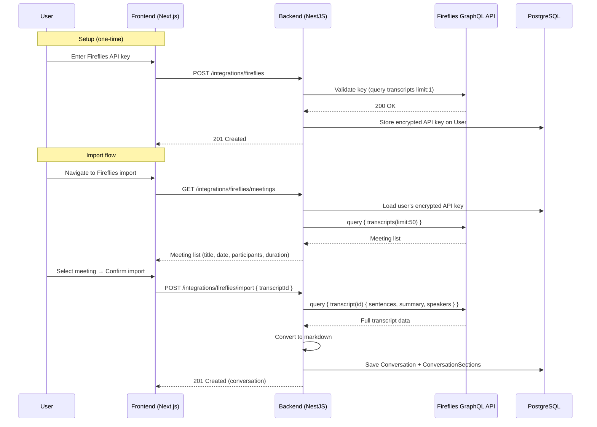
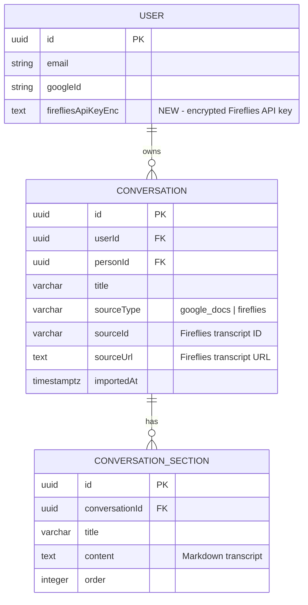
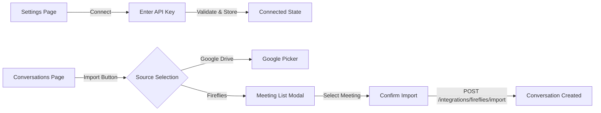

# 0009 — Fireflies.ai Transcript Import

**Date:** 2026-06-04
**Status:** Accepted
**Author:** Architect Agent
**Feature:** docs/features/0010-fireflies-transcript-import.md
**Related ADRs:** [0008 — Fireflies.ai integration via per-user API key](../decisions/0008-fireflies-per-user-api-key.md)

---

## Problem Statement

Converser currently imports conversations only from Google Drive. Many users record
meetings with Fireflies.ai and need to analyse those transcripts through the same agent
pipeline (categorisation, theme extraction, reporting). Without Fireflies support, users
must manually copy-paste transcripts into Google Docs before importing — a friction point
that limits adoption and delays analysis.

---

## Proposed Solution

Introduce a new `FirefliesModule` (backend) and corresponding frontend UI to allow users
to connect their Fireflies.ai account (via API key), browse their meetings, and import
selected transcripts as `Conversation` entities with speaker-attributed markdown content.

### Architecture Overview



### Module Structure

```
backend/src/
├── integrations/
│   ├── integrations.module.ts         # Umbrella module for all integrations
│   ├── integrations.controller.ts     # Routes: /integrations/fireflies/*
│   ├── dto/
│   │   ├── connect-fireflies.dto.ts   # { apiKey: string }
│   │   └── fireflies-meeting.dto.ts   # Response shape for meeting list
│   └── fireflies/
│       ├── fireflies.module.ts        # Provides FirefliesService
│       ├── fireflies.service.ts       # GraphQL API client
│       └── fireflies.types.ts         # API response interfaces
```

### Database Schema Changes

**New column on `users` table:**

| Column | Type | Notes |
|---|---|---|
| `fireflies_api_key_enc` | text, nullable | AES-256-GCM encrypted API key (same pattern as `google_access_token_enc`) |

A single new column is sufficient since Fireflies uses a static API key (no refresh
token or expiry). If we later add more integrations (Otter.ai, etc.), we can extract
to a separate `user_integrations` table — but for one integration, a column avoids
over-engineering.

### Entity Changes



No new tables required — the existing `conversations` and `conversation_sections`
tables support multiple source types via `sourceType`.

### API Endpoints

| Method | Path | Description |
|---|---|---|
| POST | `/integrations/fireflies` | Connect Fireflies (store API key) |
| DELETE | `/integrations/fireflies` | Disconnect Fireflies (remove API key) |
| GET | `/integrations/fireflies/status` | Check if connected |
| GET | `/integrations/fireflies/meetings` | List available meetings (paginated) |
| POST | `/integrations/fireflies/import` | Import a specific transcript |

**Connect DTO:** `{ apiKey: string }`
**Import DTO:** `{ transcriptId: string, personId?: string }`
**Meetings query params:** `?skip=0&limit=20&fromDate=2025-01-01`

### Fireflies GraphQL Client

The `FirefliesService` encapsulates all communication with the Fireflies API:

```typescript
@Injectable()
export class FirefliesService {
  private readonly endpoint = 'https://api.fireflies.ai/graphql';

  async listMeetings(apiKey: string, options: ListMeetingsOptions): Promise<FirefliesMeeting[]>;
  async getTranscript(apiKey: string, transcriptId: string): Promise<FirefliesTranscript>;
  async validateApiKey(apiKey: string): Promise<boolean>;
}
```

- Uses `fetch` (no external GraphQL client library needed — queries are simple and static)
- Accepts the API key per-call (decrypted in the controller/service layer, not stored in the service)
- Returns normalised interfaces, not raw GraphQL responses
- Implements retry with exponential backoff for rate limits (429 responses)
- Logs request duration and response status (never logs the API key)

### Markdown Conversion

Fireflies returns sentences with speaker names and timestamps. The converter produces:

```markdown
## Meeting: Weekly 1-1 with Alice

**Date:** 2026-06-01
**Duration:** 30 minutes
**Participants:** Alice Smith, Bob Jones

---

**Alice Smith** (00:00:05)
Hello, how's everything going this week?

**Bob Jones** (00:00:12)
Pretty good! I wanted to talk about the project timeline...

**Alice Smith** (00:01:45)
Sure, let's dig into that.
```

This maps to a single `ConversationSection` with `title: "Transcript"` and the full
markdown as `content`. If the Fireflies response includes AI-generated summary/action
items, those are stored as a second section (`title: "Summary"`, order: 1).

### Frontend UI



- **Settings/Integrations page:** New route `/settings/integrations` with a card for
  Fireflies showing connection status, connect/disconnect actions
- **Import flow:** The existing "Import" button on `/conversations` gains a dropdown or
  modal to choose source (Google Drive vs Fireflies). Selecting Fireflies opens a
  meeting list with search, date filtering, and pagination.
- **Meeting list:** Shows title, date, duration, participants. User selects one and
  optionally assigns a Person before confirming.

---

## Alternatives Considered

### Alternative A — Separate `user_integrations` table

Store all external integration credentials in a normalised `user_integrations` table
with columns `(user_id, provider, credentials_enc, connected_at)`.

**Why rejected:** Over-engineering for a single integration. The column-on-user pattern
is already established for Google tokens. If we add a third integration, we can refactor
then (and migrate data from the column). YAGNI applies.

### Alternative B — OAuth-based Fireflies auth

Attempt to use Fireflies as an OAuth provider so users don't manage API keys.

**Why rejected:** Fireflies does not offer OAuth for third-party apps. Their API uses
static user-generated API keys only. No alternative auth mechanism exists.

### Alternative C — Webhook-driven ingestion (auto-import)

Set up Fireflies webhooks to auto-import every new transcript.

**Why rejected for now:** Adds complexity (public webhook endpoint, verification,
background processing) and the user brief specifies "select specific meeting to import."
Webhook-based auto-import is a good future enhancement once manual import is proven.

### Alternative D — Store transcript as multiple sections (one per speaker turn)

Split the transcript into one `ConversationSection` per speaker turn.

**Why rejected:** Would create hundreds of sections per conversation, complicating the
UI and agent processing. A single markdown section with the full transcript is
consistent with how Google Docs conversations are stored (one section = one logical
content block).

---

## Impact Assessment

| Area | Impact | Notes |
|---|---|---|
| Database | Migration required | New nullable column on `users` table |
| API contract | Additive | New endpoints under `/integrations/fireflies/*` |
| Frontend | New pages + modified import flow | Settings/integrations page; import source selection |
| Tests | New unit + integration tests | FirefliesService, IntegrationsController, import flow |
| External API | New integration | Fireflies GraphQL API; rate limit awareness needed |
| Infrastructure | None | No new cloud resources; API key stored in DB (encrypted) |
| Observability | New log fields | `sourceType: 'fireflies'`, request duration to Fireflies API |
| Security / Compliance | New credential storage | API key encrypted at rest (AES-256-GCM); same pattern as Google tokens |

---

## Open Questions

None — the brief is clear and the Fireflies API is well-documented.

---

## Acceptance Criteria

1. `POST /integrations/fireflies` with a valid API key stores the encrypted key and returns 201
2. `POST /integrations/fireflies` with an invalid API key returns 400 with a clear error message
3. `DELETE /integrations/fireflies` removes the stored key and returns 204
4. `GET /integrations/fireflies/status` returns `{ connected: boolean }` for the authenticated user
5. `GET /integrations/fireflies/meetings` returns a paginated list of meetings (title, date, duration, participants) when a valid key is stored
6. `GET /integrations/fireflies/meetings` returns 400 if no Fireflies key is configured
7. `POST /integrations/fireflies/import` with a valid `transcriptId` creates a Conversation with `sourceType: 'fireflies'`, a section containing the markdown transcript, and optionally links to a Person
8. The imported markdown contains speaker names, timestamps, and dialogue in a readable format
9. If Fireflies API returns a summary, it is stored as a second ConversationSection
10. Duplicate import (same `transcriptId` for same user) is handled gracefully (returns existing conversation or updates it)
11. Rate limit errors from Fireflies API result in a 429 response to the client with a Retry-After hint
12. The Fireflies API key is never logged, never returned in API responses, and encrypted at rest with AES-256-GCM
13. Frontend settings page shows Fireflies connection status and allows connect/disconnect
14. Frontend import flow allows choosing between Google Drive and Fireflies as source
15. User isolation: users can only access their own integration credentials and imported conversations
