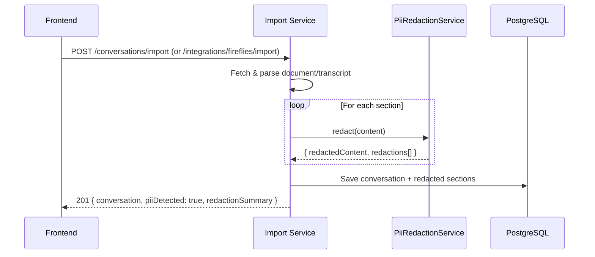

# 0010 — PII Detection and Redaction at Import

**Date:** 2026-06-04
**Status:** Accepted
**Author:** Architect Agent
**Feature:** docs/features/0011-pii-detection-redaction.md
**Related ADRs:** *(populated on acceptance)*

---

## Problem Statement

Conversations imported into Converser may contain personally identifiable information
(PII) that participants share during meetings — email addresses, phone numbers, physical
addresses, national ID numbers, credit card numbers, or dates of birth. Under ISO 27001
data minimisation principles, this PII should not be stored since Converser's purpose is
theme analysis, not identity management. Currently, PII passes through unfiltered and is
stored in the `conversation_sections` table classified as `confidential`. Redacting PII
at ingestion time reduces compliance risk and limits breach blast radius.

---

## Proposed Solution

Introduce a `PiiRedactionService` as a standalone NestJS module that scans text content
using regex-based pattern matching and replaces detected PII with `[REDACTED]`. Both
import flows (Google Drive and Fireflies) call this service on section content before
persistence. The service returns metadata about what was redacted, which is surfaced to
the user via the import API response.

### Architecture Overview



### Module Structure

```
backend/src/
├── pii/
│   ├── pii.module.ts              # Exports PiiRedactionService
│   ├── pii-redaction.service.ts   # Core detection & redaction logic
│   ├── pii-redaction.service.spec.ts
│   └── pii.types.ts               # RedactionResult, PiiCategory types
```

### PII Detection Approach

Uses the `pii-detect` npm package (zero-dependency, regex + checksum validation) as the
foundation, supplemented with custom patterns for PII types not covered by the library.

**From `pii-detect`:** email, phone numbers, credit cards (Luhn-validated), US SSN, dates of birth
**Custom patterns added:** UK National Insurance numbers, Australian Tax File Numbers, physical/mailing addresses

| Category | Source | Pattern Strategy |
|---|---|---|
| Email addresses | `pii-detect` | RFC 5322 simplified regex |
| Phone numbers | `pii-detect` | International + common national formats |
| Credit card numbers | `pii-detect` | Luhn-validated 13-19 digit sequences |
| US SSN | `pii-detect` | `XXX-XX-XXXX` with validation |
| Dates of birth | `pii-detect` | Date patterns with context keywords |
| UK NI numbers | Custom regex | `[A-CEGHJ-PR-TW-Z]{2}\d{6}[A-D]` |
| AU Tax File Numbers | Custom regex | `\d{3}\s?\d{3}\s?\d{3}` with context |
| Physical addresses | Custom regex | Number + street suffix + optional postcode heuristic |

### New Dependency

| Package | Purpose | License | Downloads/wk | Last release | Deps |
|---|---|---|---|---|---|
| `pii-detect` | PII detection with checksum validation | Apache-2.0 | ~10 (new, May 2026) | May 2026 | Zero |

**Justification:** Zero-dependency, TypeScript-native, checksum validation reduces false
positives (Luhn for CC, mod-97 for IBAN). Small bundle. Supplemented with custom patterns
for cases it doesn't cover. Can be replaced with AWS Comprehend later if needed.

### API Response Changes

Import endpoints gain two new optional fields in the response:

```typescript
interface ImportResponse {
  // ... existing conversation fields
  piiDetected: boolean;
  redactionSummary?: {
    totalRedactions: number;
    categories: Record<PiiCategory, number>;  // e.g. { email: 2, phone: 1 }
  };
}
```

### Integration Points

The service is called in two places:

1. **`ConversationsService.importFromGoogleDocs`** — after parsing sections, before save
2. **`IntegrationsService.importFromFireflies`** — after markdown conversion, before save

Both call `piiRedactionService.redact(content)` on each section's content string.

### Frontend Changes

The conversations page shows a notification banner after import when `piiDetected` is
true:

```
⚠️ PII detected and redacted: 2 email addresses, 1 phone number were removed from this conversation.
```

---

## Alternatives Considered

### Alternative A — AI/ML-based detection (AWS Comprehend)

Use Amazon Comprehend PII detection for ML-powered entity recognition with full
international coverage.

**Why rejected for now:** Adds network call per import (latency), costs ~$0.01/100 chars,
and introduces runtime dependency on AWS availability. The standard PII categories can be
covered with regex + checksum validation locally. Can upgrade to Comprehend later if
false-negative rates are unacceptable or address detection needs improvement.

### Alternative B — Pure hand-rolled regex (no library)

Build all detection patterns from scratch without a dependency.

**Why rejected:** `pii-detect` already provides well-tested patterns with checksum
validation (Luhn for credit cards) — no reason to reimplement. Zero-dependency library
means no transitive risk. Custom patterns are only added for gaps the library doesn't
cover.

### Alternative C — Detect at read-time (display redaction)

Store raw content and redact when displayed to the user.

**Why rejected:** Violates data minimisation — PII would still be stored in the database.
If the database is compromised, PII is exposed. Redaction at ingestion ensures PII never
reaches persistent storage.

---

## Impact Assessment

| Area | Impact | Notes |
|---|---|---|
| Database | None | No schema changes — redacted content uses existing `text` columns |
| API contract | Additive | New optional fields `piiDetected` and `redactionSummary` in import responses |
| Frontend | Minor component change | Notification banner on import success |
| Tests | New unit tests | PiiRedactionService patterns + integration in import flows |
| External API | None | All detection is local regex — no network calls |
| Infrastructure | None | No new resources |
| Observability | New log fields | Redaction events logged (category counts, never PII values) |
| Security / Compliance | Positive | Reduces stored PII; supports ISO 27001 A.5.10 data minimisation |

---

## Open Questions

None.

---

## Acceptance Criteria

1. `PiiRedactionService.redact(text)` returns `{ content: string, redactions: RedactionResult[] }` where `content` has all detected PII replaced with `[REDACTED]`
2. Email addresses matching common formats are detected and redacted
3. Phone numbers in international and common national formats (US, UK, AU) are detected and redacted
4. Credit card numbers (Luhn-valid, 13-19 digits) are detected and redacted
5. National ID numbers (US SSN, UK NI, AU TFN) are detected and redacted
6. Physical/mailing addresses following number + street patterns are detected and redacted
7. Dates of birth preceded by context keywords (DOB, born, birthday, date of birth) are detected and redacted
8. `POST /conversations/import` response includes `piiDetected: boolean` and `redactionSummary` when PII is found
9. `POST /integrations/fireflies/import` response includes `piiDetected: boolean` and `redactionSummary` when PII is found
10. Participant/speaker names are NOT redacted (they are intentional meeting metadata)
11. A conversation with no PII is stored unchanged; response has `piiDetected: false`
12. Redaction events are logged with category counts (never the actual PII values)
13. Frontend shows a notification banner when `piiDetected` is true in the import response
